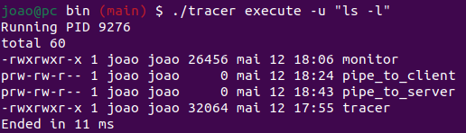
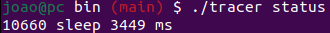
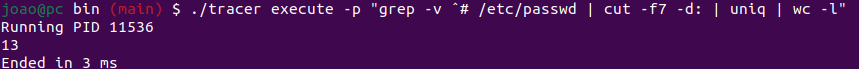
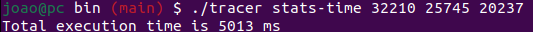
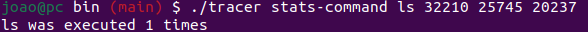
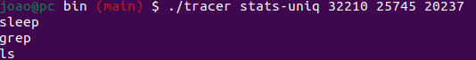

# Program Execution Tracking and Monitoring
## Description
We aim to implement a program monitoring service for a machine. Users should be able to execute programs through the client and obtain their execution time (i.e., the total time from when the user requests the client to run the program until its completion). A system administrator should be able to check, through the server, all programs currently running, including the time spent by each. Finally, the server should also allow the querying of statistics on completed programs (e.g., the aggregate execution time of a certain set of programs).

We will be using named piped and unnamed pipes to communicate between files and between processes.

## Usage

Here is a how the program should be used:

1. Opens at least two terminals, one for the monitor (server) and one for the tracer (client). You can have multiple clientes running at the same time.
2. After navigating to the bin folder execute **make**.
3. Create folder where you will store the **PIDs** of the programs that have finished executing.
4. To start running the server execute **./monitor (path to the folder created)**.
5. To start a client execute **./tracer (option)**.
	1. We can do **./tracer execute -u (string with the command)** which will run the command as if it was executed in the bash. It also informs the user about the PID of the program when it starts running and also its execution time when it ends.
	

  	  
	

    2. **./tracer status** shows the user all the running programs and their execution time until the moment
    

  	  
	

    3. **./tracer execute -p (string with pipeline)** which will run the pipeline as if it was executed in the bash. It gives the same information to the user as the command **execute -u**.
    

  	  
	

    4. **./tracer stats-time (PIDs separated by a space)**, this will give you the total time of execution of those PIDs you give to the client.
    

  	  
	

    5. **./tracer stats-command (name of command) (string with PIDs)**, this will give you the number of times the command was executed in those PIDs you give to the client.
    

  	  
	

    6. **./tracer stats-uniq (PIDs separated by a space)**, this will give you, one by line, the name of the commands that were executed in those PIDs you give to the client.
    

  	  
	

